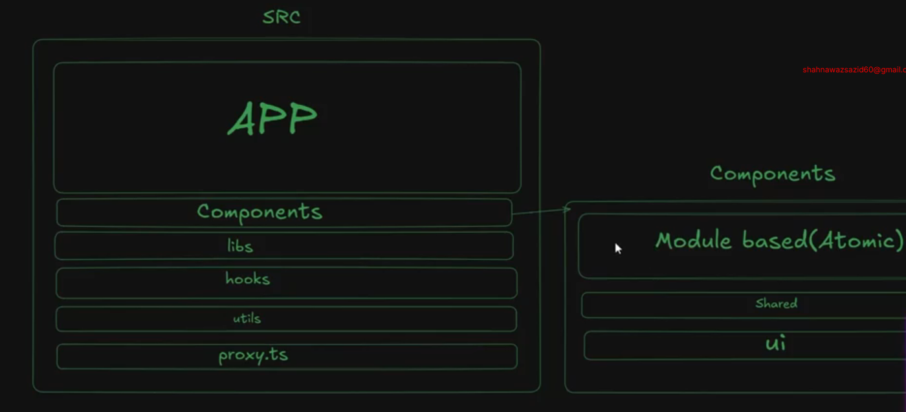

## PH-HEALTHCARE-FRONTEND-PART-1

GitHub Repo: https://github.com/Apollo-Level2-Web-Dev/ph-health-care/tree/part-1
Those who will face setup issue for them, this is the setup branch: https://github.com/Apollo-Level2-Web-Dev/ph-health-care/tree/main


## 65-1 understanding the flow of the project


## 65-2 setting up the backend server

- Just run the backend and then run the frontend 

## 65-3 setting up the Frontend with Next.js 16

- install Next.js 

```
npx create-next-app@latest
```

- install shadcn 

```
npx shadcn@latest init
```

```
npx shadcn@latest add button
```

- run the project 

```
npm run dev

```

- we will implement in modular pattern 




## 65-4 starting the atomic component based journey with nextjs 16

app -> (commonLayout) -> page.tsx (main page)

```tsx
import { Button } from "@/components/ui/button";


export default function Home() {
  return (
    <div>
      <h1>Welcome to the Next.js App</h1>
      <Button variant="default">
        Click me
      </Button>
    </div>
  );
}
```

## 65-5 Glimps of AI Native Development with ph-health-care

- app -> (commonLayout) -> page.tsx (main page)


```tsx

export default function Home() {
  return (
    <div>

    </div>
  );
}

```

- components -> (shared) -> PublicNavbar.tsx

```tsx
import Link from "next/link";

const PublicNavbar = () => {
    return (
        <header>
            <div>
                <Link  href="/" className=" flex items-center justify-center text-xl font-bold text-primary">PH-Health</Link>
            </div>
        </header>
    );
};

export default PublicNavbar;
```
- app -> (commonLayout) -> layout.tsx

```tsx
import PublicNavbar from "@/components/modules/shared/PublicNavbar";

const CommonLayout = ({ children }: { children: React.ReactNode }) => {
    return (
        <>
            <PublicNavbar />
            {children}
            
        </>
    );
};

export default CommonLayout;
```