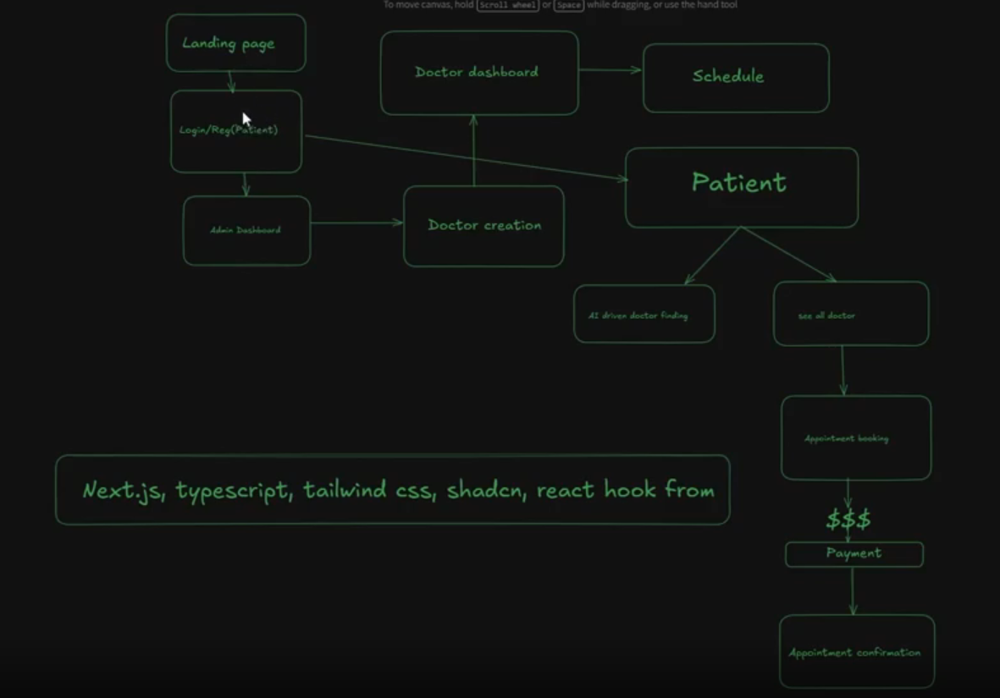

## PH-HEALTHCARE-FRONTEND-PART-5

GitHub Link: https://github.com/Apollo-Level2-Web-Dev/ph-health-care/tree/new-part-5

## 69-1 Creating serverFetch Function For Reusable Fetch Function

- we are using raw fetch method for data fetching because next.js extends and adds power of caching and many more features . if we use tanstack and axios and rtk we will miss those features. We are missing some features of axios if we use raw query, like we can not set ase url base url in one place and use it everywhere. so to solve this problem we will create a reusable fetch function called serverFetch. as well as we can not use interceptors. 

- so we will create a reuseable function that will work as `axios`.

- src -> lib -> serverFetch.ts

```ts 
import { getCookie } from "@/services/auth/tokenHandler";

const BACKEND_API_URL = process.env.NEXT_PUBLIC_BASE_API_URL || 'http://localhost:5000/api/v1';

export const serverFetchHelper = async (endpoint: string, options: RequestInit): Promise<Response> => {
    const { headers, ...restOptions } = options;

    const accessToken = await getCookie('accessToken');


    const response = await fetch(`${BACKEND_API_URL}${endpoint}`, {
        // we will change the headers here for automatically accessing token  
        headers: {
            ...headers,
            // ...(accessToken?{ 'Authorization': `Bearer ${accessToken}` } : {})
            // ...(accessToken ? { 'Authorization': accessToken } : {}) // our backend do not support Authorization 


            // there another problem arose here. as its gonna run in server action we can not access the token from cookie and we have to manually do it.
            
            Cookie : accessToken ? `accessToken=${accessToken}` : ''
        },
        ...restOptions
    })

    return response

}
// how we will add the methods? we are creating a helper function


export const serverFetch = {
    get: async (endpoint: string, options: RequestInit = {}): Promise<Response> => serverFetchHelper(endpoint, { ...options, method: "GET" }),

    post: async (endpoint: string, options: RequestInit = {}): Promise<Response> => serverFetchHelper(endpoint, { ...options, method: "POST" }),

    put: async (endpoint: string, options: RequestInit = {}): Promise<Response> => serverFetchHelper(endpoint, { ...options, method: "PUT" }),

    patch: async (endpoint: string, options: RequestInit = {}): Promise<Response> => serverFetchHelper(endpoint, { ...options, method: "PATCH" }),

    delete: async (endpoint: string, options: RequestInit = {}): Promise<Response> => serverFetchHelper(endpoint, { ...options, method: "DELETE" }),

}

/**
 * 
 * serverFetch.get("/auth/me")
 * serverFetch.post("/auth/login", { body: JSON.stringify({}) })
 */
```

## 69-1 Creating serverFetch Function For Reusable Fetch Function

- we will start working from admin works because admin can create doctor, manage doctor, manage appointment, manage users everything from admin panel. so its better to start from admin panel. then doctor works will be done and then the patient works will be done.

- Structure analysis done 

## 69-3 Creating Reusable Management Table Components

- component -> ManagementTable -> ManagementTable.tsx

```tsx
"use client";
import { Edit, Eye, Loader2, MoreHorizontal, Trash } from "lucide-react";
import React from "react";
import { Button } from "../ui/button";
import {
    DropdownMenu,
    DropdownMenuContent,
    DropdownMenuItem,
    DropdownMenuTrigger,
} from "../ui/dropdown-menu";
import {
    Table,
    TableBody,
    TableCell,
    TableHead,
    TableHeader,
    TableRow,
} from "../ui/table";

/**
 * ManagementTable
 * ----------------
 * Generic, reusable "management" table component intended for lists with optional row actions.
 * It is intentionally simple and unopinionated about the data shape — you provide:
 *  - columns: how each column should render
 *  - data: array of row objects
 *  - getRowKey: stable unique key extractor for each row (string)
 *  - optional handlers for view/edit/delete actions
 *
 * Key design goals:
 *  - Type-safe: generic <T> allows column accessors to reference properties of your row type.
 *  - Flexible rendering: column accessor can be a key of T (simple cell) or a function (custom JSX).
 *  - Performance: consumer provides getRowKey to ensure stable keys for mapping lists.
 *  - UX: built-in empty state and a "refreshing" overlay to indicate background updates.
 *
 * Usage examples:
 * 1) Simple usage with property accessors:
 *    const columns: Column<User>[] = [
 *      { header: 'Name', accessor: 'name' },
 *      { header: 'Email', accessor: 'email' },
 *    ];
 *    <ManagementTable
 *      data={users}
 *      columns={columns}
 *      getRowKey={(u) => u.id}
 *      onView={(u) => openUser(u.id)}
 *    />
 *
 * 2) Custom cell rendering:
 *    const columns: Column<User>[] = [
 *      { header: 'Name', accessor: (u) => <strong>{u.name}</strong> },
 *      { header: 'Joined', accessor: (u) => formatDate(u.joinedAt) },
 *    ];
 *
 * Notes:
 *  - If you use property accessors (keys of T), non-string values are coerced via String(...).
 *    If you need richer content (elements, icons, buttons), use an accessor function.
 *  - getRowKey must return a unique stable string for each row. Do not use array index for keys.
 *  - Action handlers (onView/onEdit/onDelete) are optional. If none are provided, the Actions column is omitted.
 *  - The component uses the project's Button/Dropdown/Table primitives — adjust classes or wrappers if needed.
 */

/*
  Column<T>
  - Represents a single column definition for the table.
  - header: visible header label shown in the table header for this column.
  - accessor:
      - A keyof T (e.g. 'name') means the table will read the property value from the row object.
      - A function (row => ReactNode) allows fully custom rendering for that cell.
  - className: optional CSS classes applied to the TableCell for this column (alignment, width, etc).
*/
export interface Column<T> {
    header: string;
    accessor: keyof T | ((row: T) => React.ReactNode);
    className?: string;
}

/*
  ManagementTableProps<T>
  - data: array of row objects to render.
  - columns: column definitions controlling header and cell rendering.
  - onView/onEdit/onDelete: optional callbacks invoked with the full row object when a user selects the action.
  - getRowKey: REQUIRED. Must return a stable, unique string key per row (e.g. id.toString()).
      This is important to keep React list reconciliation correct and to avoid re-mounting rows unnecessarily.
  - emptyMessage: custom message when data is empty (default: "No records found.").
  - isRefreshing: when true the component shows a modal-like overlay with a spinner to block actions and indicate loading.
*/
interface ManagementTableProps<T> {
    data: T[];
    columns: Column<T>[];
    onView?: (row: T) => void;
    onEdit?: (row: T) => void;
    onDelete?: (row: T) => void;
    getRowKey: (row: T) => string;
    emptyMessage?: string;
    isRefreshing?: boolean;
}

/**
 * ManagementTable<T>
 * Generic management-style table component.
 *
 * Rendering behavior summary:
 *  - Renders a header row from columns[].header.
 *  - For each data item renders a TableRow and one TableCell per column.
 *  - If a column.accessor is a function it is called with the row and the returned ReactNode is rendered.
 *  - If accessor is a key of the row, the component reads that property and renders String(value).
 *  - If any of onView/onEdit/onDelete are provided, a trailing "Actions" column is rendered with a dropdown menu.
 *  - If isRefreshing is true an overlay with a spinner is shown and user interactions are visually blocked.
 */
function ManagementTable<T>({
    data = [],
    columns = [],
    onView,
    onEdit,
    onDelete,
    getRowKey,
    emptyMessage = "No records found.",
    isRefreshing = false,
}: ManagementTableProps<T>) {
    // Presence of any action callback controls whether the Actions column is shown.
    // This keeps the table layout simpler when no row actions are needed.
    const hasActions = onView || onEdit || onDelete;

    return (
        <>
            <div className="rounded-lg border relative">
                {/* Refreshing Overlay
                    - Covers the entire table area with a translucent layer and a spinner.
                    - Useful when parent triggers a background refresh and you want to prevent clicks.
                    - Accessibility: Consider additionally managing focus/aria-busy on the parent if needed.
                */}
                {isRefreshing && (
                    <div className="absolute inset-0 bg-background/50 backdrop-blur-[2px] flex items-center justify-center z-10 rounded-lg">
                        <div className="flex flex-col items-center gap-2">
                            <Loader2 className="h-6 w-6 animate-spin text-primary" />
                            <p className="text-sm text-muted-foreground">Refreshing...</p>
                        </div>
                    </div>
                )}

                <Table>
                    <TableHeader>
                        <TableRow>
                            {/* Header cells: render in the same order as columns prop */}
                            {columns?.map((column, colIndex) => (
                                <TableHead key={colIndex} className={column.className}>
                                    {column.header}
                                </TableHead>
                            ))}

                            {/* Actions header: only render if we have action handlers */}
                            {hasActions && (
                                <TableHead className="w-[70px]">Actions</TableHead>
                            )}
                        </TableRow>
                    </TableHeader>

                    <TableBody>
                        {/* Empty state: single full-width row with message */}
                        {data.length === 0 ? (
                            <TableRow>
                                <TableCell
                                    colSpan={columns.length + (hasActions ? 1 : 0)}
                                    className="text-center py-8 text-muted-foreground"
                                >
                                    {emptyMessage}
                                </TableCell>
                            </TableRow>
                        ) : (
                            /* Data rows:
                               - Iterate over data and render a TableRow per item.
                               - Use getRowKey(item) for stable React keys (required for lists).
                               - Each column either uses a render function or reads a property from the row.
                               - Casting to String ensures primitive values render safely; prefer accessor functions for JSX.
                            */
                            data?.map((item) => (
                                <TableRow key={getRowKey(item)}>
                                    {columns.map((col, idx) => (
                                        <TableCell key={idx} className={col.className}>
                                            {typeof col.accessor === "function"
                                                // Custom renderer: allow consumer to return any React node
                                                ? col.accessor(item)
                                                // Property accessor: access the field and coerce to string.
                                                // IMPORTANT: Using String(...) here means null/undefined become "null"/"undefined".
                                                // If you want empty cells instead, provide an accessor function that returns "" as needed.
                                                : String(item[col.accessor])}
                                        </TableCell>
                                    ))}

                                    {/* Actions dropdown:
                                        - Rendered only when at least one action handler exists.
                                        - Each menu item only appears if its corresponding handler is provided.
                                        - Handlers receive the full row object — caller can extract id or other fields.
                                        - Styling: destructive class on Delete to visually warn user.
                                    */}
                                    {hasActions && (
                                        <TableCell>
                                            <DropdownMenu>
                                                <DropdownMenuTrigger asChild>
                                                    <Button variant="ghost" size="icon">
                                                        <MoreHorizontal className="h-4 w-4" />
                                                    </Button>
                                                </DropdownMenuTrigger>
                                                <DropdownMenuContent align="end">
                                                    {onView && (
                                                        <DropdownMenuItem onClick={() => onView(item)}>
                                                            <Eye className="mr-2 h-4 w-4" />
                                                            View
                                                        </DropdownMenuItem>
                                                    )}
                                                    {onEdit && (
                                                        <DropdownMenuItem onClick={() => onEdit(item)}>
                                                            <Edit className="mr-2 h-4 w-4" />
                                                            Edit
                                                        </DropdownMenuItem>
                                                    )}
                                                    {onDelete && (
                                                        <DropdownMenuItem
                                                            onClick={() => onDelete(item)}
                                                            className="text-destructive"
                                                        >
                                                            <Trash className="mr-2 h-4 w-4" />
                                                            Delete
                                                        </DropdownMenuItem>
                                                    )}
                                                </DropdownMenuContent>
                                            </DropdownMenu>
                                        </TableCell>
                                    )}
                                </TableRow>
                            ))
                        )}
                    </TableBody>
                </Table>
            </div>
        </>
    );
}

export default ManagementTable;
```

## 69-4 Creating Reusable Management Page Header and Refresh Button Components

- component -> ManagementPageHeader -> ManagementPageHeader.tsx

```tsx
"use client"
import { LucideIcon, Plus } from "lucide-react";
import React from "react";
import { Button } from "../ui/button";

interface ManagementHeaderProps {
    title: string,
    description?: string
    children?: React.ReactNode // for modal opening button 

    // purpose of this is to make the ui future proof if any other action is needed in future
    action?: {
        label: string,
        icon?: LucideIcon,
        onClick: () => void,
    }
}


const ManagementPageHeader = ({ title, description, children, action }: ManagementHeaderProps) => {
    const Icon = action?.icon || Plus;
    return (
        <div className="flex items-center justify-between">
            <div>
                <h1 className="text-3xl font-bold">{title}</h1>
                {description && <p className="text-muted-foreground mt-1">{description}</p>}
            </div>
            {action && (
                <Button onClick={action.onClick} >
                    <Icon className="mr-2 h-4 w-4" />
                    {action.label}
                </Button>
            )}

            {children}

        </div>
    );
};

export default ManagementPageHeader;
```

- component -> RefreshButton -> RefreshButton.tsx

```tsx
"use client";
import { RefreshCcw } from "lucide-react";
import { useRouter } from "next/navigation";
import { useTransition } from "react";
import { Button } from "../ui/button";

interface RefreshButtonProps {
    size?: "sm" | "default" | "lg";
    variant?: "default" | "outline" | "ghost";
    showLabel?: boolean;
}

const RefreshButton = ({
    size = "default",
    variant = "default",
    showLabel = true,
}: RefreshButtonProps) => {
    const router = useRouter();
    const [isPending, startTransition] = useTransition(); // lets us re render a part of the of the ui not the full page/ full component. 


    const handleRefresh = () => {
        startTransition(() => {
            router.refresh(); // because of using transition it will run in background without blocking the UI
        });
    };
    return (
        <Button
            size={size}
            variant={variant}
            onClick={handleRefresh}
            disabled={isPending}
        >
            <RefreshCcw className={`h-4 w-4 ${isPending ? "animate-spin" : ""} ${showLabel ? "mr-2" : ""}`}
            />
            {showLabel && "Refresh"}
        </Button>
    );
};

export default RefreshButton;
```
## 69-5 Creating Reusable Search Filter and Select Filter Components

- lets think about the search and filter 
- the route will be `http://localhost:3000/admin/dashboard/admins-management`
- if search happens the route will be `http://localhost:3000/admin/dashboard/admins-management?searchTerm=abc`. basically it will be query parameter 
- For Filter `http://localhost:3000/admin/dashboard/admins-management?searchjjTerm="admin1&role="superAdmin"`.
- Setting query parameter is the efficient way to do this. The `searchTerm`, and the `filter` will be returned to the `server action` of the table immediately and automatic refetching will be done.
- in the same method the pagination will work. `http://localhost:3000/admin/dashboard/admins-management?searchjjTerm="admin1&role="superAdmin"&page=1`.
- beside these while we are doing search we will have to use `debounce`. The purpose of `debounce` is to limit the number of api calls while typing. so if we type `a`, `ab`, `abc` in quick succession we will not make 3 api calls rather we will make only one api call after some delay like 500ms after the last key stroke.This will prevent api misuse and unnecessary load on the server.
- src -> hooks -> useDebounce.ts

```ts
import { useEffect, useState } from "react";

export function useDebounce<T>(value: T, delay: number = 500): T {
    const [debouncedValue, setDebouncedValue] = useState<T>(value);

    useEffect(() => {
        const handler = setTimeout(() => {
            setDebouncedValue(value);
        }, delay);

        return () => {
            clearTimeout(handler);
        };
    }, [value, delay]);

    return debouncedValue;
}
```
- component -> shared -> SearchFilter.tsx

```tsx
"use client"

import { Search } from "lucide-react";
import { Input } from "../ui/input";
import { useEffect, useState, useTransition } from "react";
import { useRouter, useSearchParams } from "next/navigation";
import { useDebounce } from "@/hooks/useDebounce";

/**
 * Props for `SearchFilter` component.
 * - `placeholder`: input placeholder text.
 * - `paramName`: query parameter name used in the URL (e.g. `?searchTerm=...`).
 */
interface SearchFilterProps {
    placeholder?: string;
    paramName?: string // ?searchTerm="admin" here the paramName is searchTerm
}

/**
 * SearchFilter
 * - Controlled input that updates the current URL query string using Next.js router.
 * - Uses a debounce hook so the URL is only updated after the user stops typing.
 * - Resets the `page` parameter to `1` when a new search is applied.
 *
 * Note: the input is currently rendered with `disabled` — keep this if the search
 * should be read-only in the UI, otherwise remove the `disabled` prop.
 */
const SearchFilter = ({ placeholder = "Search....", paramName = "searchTerm" }: SearchFilterProps) => {
    const router = useRouter()
    // useTransition lets us mark the router update as non-urgent
    // We only need the `startTransition` function here; avoid an unused variable.
    const [, startTransition] = useTransition()
    const searchParams = useSearchParams()

    // Initialize the controlled input from the current query param (if present)
    const [value, setValue] = useState(searchParams.get(paramName) || "")

    // Debounce the `value` so we don't update the URL on every keystroke
    const debouncedValue = useDebounce(value, 500)

    useEffect(() => {
        // Copy current search params so we can modify them
        const params = new URLSearchParams(searchParams.toString());

        // When the component mounts, `useState` might already have the initial value
        // from the URL. If the debounced value equals the initial URL value, do nothing.
        const initialValue = searchParams.get(paramName) || ""
        if (initialValue === debouncedValue) return; // no need to push the same value again

        if (debouncedValue) {
            // Add/update the search param and reset pagination to page 1
            params.set(paramName, debouncedValue)  // ?searchTerm=debouncedValue
            params.set("page", "1") // reset to first page on search
        } else {
            // If the search term is cleared, remove the param(s) from the URL
            params.delete(paramName)
            params.delete("page") // also remove page param if no search term
        }

        // Use startTransition to avoid blocking urgent updates/UI
        startTransition(() => {
            // Push the updated query string to the router
            router.push(`?${params.toString()}`)
        })

    }, [debouncedValue, paramName, router, searchParams])

    return (
        <div className="relative">
            {/* Search icon positioned inside the input */}
            <Search className="absolute left-3 top-1/2 -translate-y-1/2 h-4 w-4 text-muted-foreground" />

            {/* Controlled input: value is kept in component state and debounced
                before writing into the URL. Remove `disabled` if users should be
                allowed to type (it's currently present to render a non-editable field).
            */}
            <Input
                placeholder={placeholder}
                value={value}
                onChange={(e) => setValue(e.target.value)}
                disabled
                className="pl-10"
            />
        </div>
    );
};

export default SearchFilter;
```

## 69-6 Creating Reusable Select Filter And Table Skeleton Loader Components

- in filter/pagination there is no hassle of debounce because its not typing base rather its click base. so no need of debounce here.

- component -> shared -> SelectFilter.tsx

```tsx
import { useRouter, useSearchParams } from "next/navigation";
import { useTransition } from "react";
import { Select, SelectContent, SelectItem, SelectTrigger, SelectValue } from "../ui/select";

/**
 * Props for `SelectFilter` component.
 * - `paramName`: the query parameter name used in the URL (e.g. `?gender=`).
 * - `placeholder`: optional placeholder text shown when no value is selected.
 * - `options`: array of selectable options with `label` and `value`.
 */
interface SelectFilterProps {
    paramName: string; // ?gender=
    placeholder?: string;
    options: { label: string; value: string }[];
}

/**
 * SelectFilter
 * - Reads the current value from the URL (`useSearchParams`) and renders a
 *   controlled `Select` component populated from `options`.
 * - When selection changes, the component updates the URL query string using
 *   `router.push` inside `startTransition` so the navigation is treated as a
 *   non-urgent update.
 * - The special option value `"All"` is used to indicate "no filter": when
 *   selected the corresponding query param is removed from the URL.
 */
const SelectFilter = ({
    paramName,
    placeholder,
    options,
}: SelectFilterProps) => {
    const router = useRouter();
    // Provides the current set of URL search params (read-only object-like API)
    const searchParams = useSearchParams();

    // useTransition returns [isPending, startTransition]. We use `isPending` to
    // disable the select while a navigation update is in progress to prevent
    // double-submission / rapid changes; `startTransition` is used to schedule
    // the router push as a non-urgent update.
    const [isPending, startTransition] = useTransition();

    // Read current value for the given param from the URL. If the param is not
    // present we use the sentinel value "All" to represent the unfiltered state.
    const currentValue = searchParams.get(paramName) || "All";

    /**
     * handleChange
     * - `value` comes from the Select component when the user picks an item.
     * - If `value === "All"` we remove the query param to represent "no filter".
     * - Otherwise we set/update the query param with the selected value.
     * - Navigation is scheduled inside `startTransition` to avoid blocking the UI.
     */
    const handleChange = (value: string) => {
        // Clone the current search params so we can modify them safely
        const params = new URLSearchParams(searchParams.toString());

        if (value === "All") {
            // Remove the filter param entirely to show the unfiltered list/state
            params.delete(paramName);
        } else if (value) {
            // Set or update the filter param (e.g. ?gender=male)
            params.set(paramName, value);
        } else {
            // Fallback: if an empty string is provided, ensure the param is removed
            params.delete(paramName);
        }

        // Use startTransition so React treats the route update as non-urgent.
        // This helps keep the UI responsive during the navigation.
        startTransition(() => {
            router.push(`?${params.toString()}`);
        });
    };

    return (
        <Select
            value={currentValue}
            onValueChange={handleChange}
            // Disable the select while a navigation is pending to avoid multiple
            // rapid updates that could lead to unexpected states.
            disabled={isPending}
        >
            <SelectTrigger>
                {/*
          `SelectValue` shows the currently selected item or the `placeholder`
          when no value is selected. The `placeholder` prop should describe the
          filter purpose (e.g. "Select gender").
        */}
                <SelectValue placeholder={placeholder} />
            </SelectTrigger>
            <SelectContent>
                {/* Include an explicit "All" item to allow clearing the filter */}
                <SelectItem value="All">All</SelectItem>
                {options.map((option) => (
                    <SelectItem key={option.value} value={option.value}>
                        {option.label}
                    </SelectItem>
                ))}
            </SelectContent>
        </Select>
    );
};

export default SelectFilter;
```

- component -> shared -> TableSkeleton.tsx

```tsx
import { Skeleton } from "@/components/ui/skeleton";
import {
  Table,
  TableBody,
  TableCell,
  TableHead,
  TableHeader,
  TableRow,
} from "@/components/ui/table";

interface TableSkeletonProps {
  columns: number;
  rows?: number;
  showActions?: boolean;
}

export function TableSkeleton({
  columns = 6,
  rows = 10,
  showActions = true,
}: TableSkeletonProps) {
  return (
    <div className="rounded-lg border">
      <Table>
        <TableHeader>
          <TableRow>
            {[...Array(columns)].map((_, i) => (
              <TableHead key={i}>
                <Skeleton className="h-4 w-full" />
              </TableHead>
            ))}
            {showActions && (
              <TableHead className="w-[70px]">
                <Skeleton className="h-4 w-full" />
              </TableHead>
            )}
          </TableRow>
        </TableHeader>
        <TableBody>
          {[...Array(rows)].map((_, rowIndex) => (
            <TableRow key={rowIndex}>
              {[...Array(columns)].map((_, colIndex) => (
                <TableCell key={colIndex}>
                  <div className="flex items-center gap-2">
                    {colIndex === 0 && (
                      <Skeleton className="h-10 w-10 rounded-full" />
                    )}
                    <Skeleton className="h-4 w-full" />
                  </div>
                </TableCell>
              ))}
              {showActions && (
                <TableCell>
                  <Skeleton className="h-8 w-8 rounded-md" />
                </TableCell>
              )}
            </TableRow>
          ))}
        </TableBody>
      </Table>
    </div>
  );
}
```

## 69-7 Analyzing The Table Pagination Component

- lets think About table pagination 




## 69-8 Creating Table Pagination Component

- components -> shared -> TablePagination.tsx

```tsx 
"use client";

import { ChevronLeft, ChevronRight } from "lucide-react";
import { useRouter, useSearchParams } from "next/navigation";
import { useTransition } from "react";
import { Button } from "../ui/button";

/**
 * Props for the table pagination component.
 * - `currentPage`: the currently active page (1-based index).
 * - `totalPages`: total number of pages available.
 */
interface TablePaginationProps {
    currentPage: number;
    totalPages: number;
}

/**
 * TablePagination
 * - Renders a compact pagination control with "Previous", numbered page
 *   buttons (up to 5 visible), and "Next".
 * - Reads existing URL search params and updates the `page` param when the
 *   user navigates. Navigation is performed inside `startTransition` so React
 *   treats it as a non-urgent update and keeps the UI responsive.
 */
const TablePagination = ({ currentPage, totalPages }: TablePaginationProps) => {
    const router = useRouter();
    // `isPending` can be used to disable controls during navigation,
    // `startTransition` schedules the router push as a non-urgent update.
    const [isPending, startTransition] = useTransition();
    const searchParams = useSearchParams();

    /**
     * navigateToPage
     * - Clones current search params, sets the `page` param to `newPage`, and
     *   pushes the new query string using Next.js router inside a transition.
     */
    const navigateToPage = (newPage: number) => {
        const params = new URLSearchParams(searchParams.toString());
        params.set("page", newPage.toString());

        startTransition(() => {
            router.push(`?${params.toString()}`);
        });
    };

    // If there's only one page (or none), don't render the pagination UI at all.
    if (totalPages <= 1) {
        return null;
    }

    return (
        <div className="flex items-center justify-center gap-2">
            {/* Previous button */}
            <Button
                variant="outline"
                size="sm"
                onClick={() => navigateToPage(currentPage - 1)}
                // Disable when already on the first page or while a navigation is pending
                disabled={currentPage <= 1 || isPending}
            >
                <ChevronLeft className="h-4 w-4 mr-1" />
                Previous
            </Button>

            {/*
        Numbered page buttons.
        - We render up to 5 page buttons for compactness.
        - If `totalPages <= 5` we render pages 1..totalPages.
        - If `currentPage` is near the start we render 1..5.
        - If `currentPage` is near the end we render the last 5 pages.
        - Otherwise we center the current page with two pages on either side.
      */}
            <div className="flex items-center gap-1">
                {Array.from({ length: Math.min(5, totalPages) }, (_, index) => {
                    // array.from method returns an array from any iterable object. We create an array of length 5 or totalPages (whichever is smaller).
                    let pageNumber: number;

                    if (totalPages <= 5) {
                        // Small number of pages: show all
                        pageNumber = index + 1;
                    } else if (currentPage <= 3) {
                        // Near the start: show first five pages
                        pageNumber = index + 1;
                    } else if (currentPage >= totalPages - 2) {
                        // Near the end: show last five pages
                        pageNumber = totalPages - 4 + index;
                    } else {
                        // Middle range: center current page (two before, current, two after)
                        pageNumber = currentPage - 2 + index;
                    }

                    return (
                        <Button
                            key={pageNumber}
                            // Highlight the active page with the "default" variant
                            variant={pageNumber === currentPage ? "default" : "outline"}
                            size="sm"
                            onClick={() => navigateToPage(pageNumber)}
                            disabled={isPending}
                            className="w-10"
                        >
                            {pageNumber}
                        </Button>
                    );
                })}
            </div>

            {/* Next button */}
            <Button
                variant="outline"
                size="sm"
                onClick={() => navigateToPage(currentPage + 1)}
                // Disable when on the last page or while navigation is pending
                disabled={currentPage === totalPages || isPending}
            >
                Next
                <ChevronRight className="h-4 w-4 ml-1" />
            </Button>

            {/* Simple page indicator */}
            <span className="text-sm text-muted-foreground ml-2">
                Page {currentPage} of {totalPages}
            </span>
        </div>
    );
};

export default TablePagination;
```